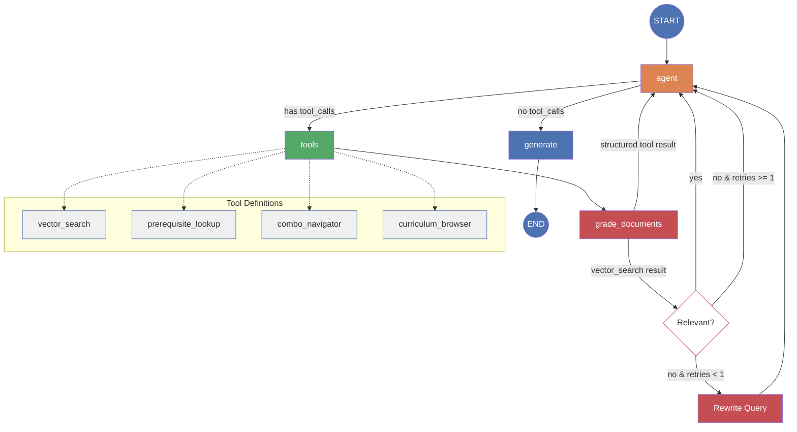

# FPT Curriculum Advisor — Technical Report

## 1. Project Overview

This project builds a **RAG-based chatbot** that serves as an academic advisor for FPT University's **Bachelor of IT in Artificial Intelligence (BIT_AI)** program, curriculum version **K20-K21**. Students can ask about courses, prerequisites, specialization combos, study planning, and acceleration strategies. The system combines semantic vector search with deterministic structured lookups, orchestrated by a LangGraph agentic loop.

### Technology Stack

| Layer | Technology |
|---|---|
| LLM | OpenAI GPT-4o-mini (temperature=0) |
| Embeddings | OpenAI text-embedding-3-small (1536 dims) |
| Vector DB | Pinecone Serverless (AWS us-east-1, cosine similarity) |
| Agent Framework | LangGraph + LangChain |
| UI | Streamlit |
| Config | Pydantic-Settings + `.env` |
| Logging | Loguru |
| Package Manager | uv |

### Project Structure

```
flm_agent/
├── src/
│   ├── __init__.py
│   ├── app.py                       # Streamlit UI entrypoint
│   ├── config.py                    # Pydantic-Settings, env loading, model names
│   ├── profiles.py                  # StudentProfile dataclass + predefined profiles
│   ├── chain/
│   │   ├── __init__.py
│   │   ├── agent.py                 # Public API: chat() with profile support
│   │   ├── graph.py                 # LangGraph StateGraph assembly
│   │   ├── nodes.py                 # Node implementations (agent, grade, generate)
│   │   ├── prompts.py               # System prompts, tool descriptions, grading
│   │   └── state.py                 # AgentState definition
│   ├── ingestion/
│   │   ├── __init__.py
│   │   ├── parser.py                # Markdown parsing, entity classification
│   │   ├── chunker.py               # Section-level chunking + metadata enrichment
│   │   ├── structured.py            # Build JSON lookup tables from parsed docs
│   │   ├── embedder.py              # Embed chunks, upsert to Pinecone
│   │   └── pipeline.py              # Orchestrate full ingestion pipeline
│   ├── retrieval/
│   │   ├── __init__.py
│   │   ├── tools.py                 # 4 LangChain Tool definitions + fuzzy resolver
│   │   └── vector_store.py          # Pinecone client wrapper
│   └── evaluation/
│       ├── __init__.py
│       ├── golden_set.py            # Load/manage golden Q&A test set
│       ├── ragas_eval.py            # LLM-as-judge evaluation runner
│       ├── baseline.py              # No-RAG baseline runner
│       └── report.py                # Generate comparison figures
├── data/
│   ├── raw/                         # 64 markdown files (syllabi, curricula, pathways)
│   └── processed/                   # Generated JSON lookup tables
│       ├── course_index.json
│       ├── prerequisites.json
│       ├── curriculum_map.json
│       ├── combo_map.json
│       ├── programme_outcomes.json
│       └── program_learning_outcomes.json
├── evaluation/
│   ├── golden_qa.json               # 48-question golden test set
│   └── results/                     # Evaluation outputs (JSON + plots + report)
├── scripts/
│   ├── run_ingestion.py             # CLI: run full ingestion pipeline
│   └── run_evaluation.py            # CLI: run evaluation suite
├── tests/
│   ├── test_parser.py
│   └── test_structured.py
├── docs/
│   └── research/
│       ├── bare_jrnl_new_sample4.tex  # IEEE journal article
│       ├── presentation.tex           # Beamer presentation (20 slides)
│       ├── generate_plots.py          # Publication-quality plot generation
│       └── figures/                   # Generated PDF plots
├── notebooks/                       # Exploratory analysis notebooks
├── .env                             # API keys (not committed)
├── pyproject.toml                   # uv project config + dependencies
└── uv.lock                          # Locked dependency versions
```

---

## 2. Data Pipeline

### 2.1 Raw Data

The corpus consists of **9 markdown files** in `data/raw/`:

- **Syllabi**: One file per course (e.g., `MAD101.MD`, `DPL302m.MD`), each structured with H1 header `# Syllabus: <code>` followed by H2 sections for general info, learning outcomes, sessions, assessments, and materials.
- **Curricula**: `Curriculum_k20_k21.md` containing the full study plan — all courses grouped by semester with credits and prerequisites.
- **Pathways**: Combo/specialization files describing elective groupings (e.g., Applied Data Science, Computer Vision) with available courses.

Each file is classified by regex on its H1 header:

```python
RE_H1_SYLLABUS    = re.compile(r"^# Syllabus:\s*(.*)", re.MULTILINE)
RE_H1_CURRICULUM  = re.compile(r"^# Curriculum:\s*(.*)", re.MULTILINE)
RE_H1_PATHWAY     = re.compile(r"^# Pathway:\s*(.*)", re.MULTILINE)
```

### 2.2 Parsing (`src/ingestion/parser.py`)

The parser converts raw markdown into `ParsedDocument` objects containing:

- `entity_type` (SYLLABUS / CURRICULUM / PATHWAY)
- `entity_id` (e.g., "PFP191", "BIT_AI_K20D-21A", "AI17_COM_1")
- `general_info` dict extracted from key-value tables
- `sections` dict mapping H2 section names to raw text
- `raw_content` for full-text access

Two table parsers handle the markdown formats found in syllabi:

- `_parse_kv_table`: For `| Key: | Value |` metadata tables (general info sections)
- `_parse_data_table`: For standard data tables with headers (assessments, sessions, curriculum details). Handles edge cases like empty-header columns (row number columns) by keeping positional alignment.

### 2.3 Structured Data Extraction (`src/ingestion/structured.py`)

Before chunking, the parser extracts **6 JSON lookup tables** from the parsed documents for deterministic tool queries:

| File | Schema | Count |
|---|---|---|
| `course_index.json` | `{code: {name, credits, semester, prerequisite, description}}` | 47 courses |
| `prerequisites.json` | `{code: prerequisite_string}` | 23 entries |
| `curriculum_map.json` | `{semester: [{code, name, credits, prerequisite}]}` | 10 semesters |
| `combo_map.json` | `{pathway_id: {description, semester, topics: {name: [courses]}}}` | 5 pathways |
| `programme_outcomes.json` | `{po_code: description}` | 5 outcomes |
| `program_learning_outcomes.json` | `{plo_name: description}` | 13 PLOs |

Key decisions in extraction:
- **Curriculum selection**: Matches `"k20_k21"` in filename stem (not by entity_id substring, which caused false matches with K18-K19).
- **Prerequisite filtering**: Excludes `{"none", "không", "no", "không none", ""}` to avoid invalid entries.
- **Course index enrichment**: Merges curriculum data (semester, credits) with syllabus data (description, learning outcomes) for a unified lookup.

### 2.4 Chunking (`src/ingestion/chunker.py`)

Documents are chunked in two stages:

1. **MarkdownHeaderTextSplitter** splits by H1 (entity) and H2 (section) headers, preserving structural boundaries.
2. **RecursiveCharacterTextSplitter** (chunk_size=500, overlap=50) sub-splits oversized chunks.

A `MIN_CHUNK_LENGTH = 50` filter removes tiny fragments from table row splits, reducing total chunks from 8,446 to **6,256**.

Each chunk carries metadata:
- `entity_type`, `entity_id`, `section`, `source_file`
- For syllabi: `course_code`, `course_name`, `credits`, `has_prerequisites`
- For pathways: `pathway_id`, `semester`

### 2.5 Embedding & Indexing (`src/ingestion/embedder.py`)

Chunks are embedded with OpenAI `text-embedding-3-small` (1536 dimensions) and upserted to Pinecone in batches of 100. Each chunk gets a deterministic ID via MD5 hash of `source_file:section:index:content_prefix`, enabling idempotent re-ingestion.

The Pinecone index uses:
- **ServerlessSpec**: AWS us-east-1 (free tier)
- **Metric**: Cosine similarity
- **Vectors**: 6,256 total

### 2.6 Pipeline Orchestration (`src/ingestion/pipeline.py`)

The full pipeline runs as:

```
parse_corpus → build_all (JSON tables) → chunk_corpus → embed_and_upsert
```

A `--skip-embed` flag allows running parse + structure + chunk without Pinecone upsert for testing.

---

## 3. Agent Architecture

### 3.1 Graph Design

The agent uses a **LangGraph StateGraph** with a multi-tool loop. The diagram below shows the full graph structure:



This design allows the agent to call **multiple tools across iterations** before producing a final answer — critical for complex questions like "Can I accelerate to Deep Learning?" which needs both `prerequisite_lookup` and `curriculum_browser`.

A `tool_call_count` safety counter (max 6) prevents infinite loops.

### 3.2 State

`AgentState` extends LangGraph's `MessagesState` with:

```python
class AgentState(MessagesState):
    retry_count: int          # query rewrite attempts (max 1)
    tool_call_count: int      # loop safety (max 6)
    grading_decision: str     # "relevant" | "rewrite" | "not_relevant"
    student_context: str      # personalized profile data
```

### 3.3 Nodes

**agent_node**: Invokes GPT-4o-mini with all 4 tools bound. Prepends the system prompt (with student context injected) on first call. When tool_call_count reaches the limit, tools are unbound to force a direct response.

**grade_documents**: Only grades `vector_search` results — structured tools (prerequisite_lookup, combo_navigator, curriculum_browser) return deterministic data and skip grading. The grader uses a binary yes/no LLM judge. If irrelevant and retries remain, it rewrites the query using `REWRITE_PROMPT`.

**generate**: Produces the final answer. Critically, it only receives the **current turn's messages** (extracted via `_extract_current_turn`), not the full conversation history. This prevents prior turns' answers from bleeding into the new response — a bug that caused the agent to repeat previous semester listings instead of answering the new question.

### 3.4 Tools

Four LangChain `@tool` functions, each backed by cached JSON data or Pinecone:

**vector_search(query, course_code?, entity_type?)**
- Semantic search over Pinecone. Accepts optional `course_code` filter to scope results to a specific course (e.g., only MAD101 chunks). Without this filter, queries like "MAD101 assessment" would match other courses' assessment sections that happened to be more semantically similar.

**prerequisite_lookup(course_code, direction)**
- Forward: "What do I need before taking X?" with full recursive chain resolution.
- Reverse: "What courses does completing X unlock?" via string matching in prerequisite values.

**combo_navigator(combo_id?, topic?)**
- Browse specialization pathways. Empty args lists all; specific ID shows details with courses grouped by topic.

**curriculum_browser(semester?, course_code?)**
- Semester listing or individual course lookup. Returns credits, prerequisites, and course counts.

### 3.5 Fuzzy Course Code Resolution

All tools share a `_resolve_course_code` helper that handles partial input:

```python
_resolve_course_code("MAE", index)  → ("MAE101", None)      # unique prefix
_resolve_course_code("AIL", index)  → ("AIL303m", None)     # unique prefix
_resolve_course_code("AI", index)   → ("AI", "ambiguous...") # multiple matches
_resolve_course_code("XYZ", index)  → ("XYZ", "not found")  # no match
```

This lets students type "Tell me about MAE" and get MAE101 results directly, rather than a "course not found" error.

### 3.6 Prompt Engineering

Four prompt templates drive agent behavior:

**AGENT_SYSTEM_PROMPT** — the core routing and reasoning instructions:
- Tool descriptions with when-to-use guidance
- Multi-tool strategy: "call multiple tools when needed, don't answer from a single call if the question spans domains"
- FPT academic rules: 10-week semesters, 1-month breaks, max 2 extra courses from next semester, retake policy
- Student profile cross-referencing: failed courses block prerequisites, show what can/can't be taken
- Partial course code handling: "treat as prefix, don't expand abbreviations"
- Answer quality: cite codes, reference tools, never fabricate, never say "I'll look that up"

**GENERATE_SYSTEM_PROMPT** — final synthesis instructions:
- Focus on current turn's tool results only
- Never produce incomplete "let me check" responses
- Cross-reference student's failed courses with prerequisites

**GRADING_PROMPT** — binary relevance judge for vector search results.

**REWRITE_PROMPT** — query optimizer that preserves course code prefixes (prevents "MAE" → "Master of Arts in Education" hallucination).

---

## 4. Student Personalization

### 4.1 Profile Model

```python
@dataclass
class StudentProfile:
    name: str
    student_id: str
    current_semester: int
    passed_courses: dict[str, float]   # code → grade (0-10)
    failed_courses: dict[str, float]   # code → grade (FAILED)
```

The `summary()` method produces a natural-language context block injected into the system prompt via `{student_context}`.

### 4.2 Predefined Test Profiles

| Profile Key | Persona | Semester | Courses | Notes |
|---|---|---|---|---|
| `none` | Anonymous | 0 | 0 | General questions only |
| `freshman_s1` | Nguyen Van An | 1 | 2 passed | Just started |
| `sophomore_s3` | Tran Thi Bao | 3 | 12 passed | Solid GPA ~7.7 |
| `junior_s5` | Le Hoang Minh | 5 | 21 passed | AI specialization track |
| `struggling_s4` | Pham Duc Huy | 4 | 16 passed, 1 failed (MAS291) | Low math GPA, blocked from AIL303m |

### 4.3 How Personalization Works

The student context flows through the system:

1. **UI** (`app.py`): User selects a profile from the sidebar dropdown
2. **API** (`agent.py`): `chat()` builds the context string from `profile.summary()`
3. **State**: `student_context` stored in `AgentState`, passed to all nodes
4. **Prompts**: Both `AGENT_SYSTEM_PROMPT` and `GENERATE_SYSTEM_PROMPT` contain `{student_context}` placeholder, filled by `_build_system_prompt()`
5. **Agent reasoning**: The LLM sees the student's passed/failed courses and cross-references with tool results (e.g., "MAS291 failed → can't take AIL303m → can't take DPL302m")

---

## 5. Streamlit UI

The interface (`src/app.py`) provides:

- **Sidebar**: Profile selector dropdown with expandable profile details, suggested question list, clear conversation button, and tool call citations (expandable with raw tool results)
- **Main area**: Chat message history with streaming responses
- **Session state**: Messages and citations persisted across reruns

Running the app:

```powershell
$env:PYTHONPATH = "."
uv run streamlit run src/app.py --server.headless true --server.port 8501
```

---

## 6. Evaluation Framework

### 6.1 Golden Test Set

50 curated Q&A pairs in `evaluation/golden_qa.json` across 5 categories:

| Category | Count | Example Question |
|---|---|---|
| factual_lookup | 10 | "How many credits is DPL302m?" |
| prerequisite_reasoning | 10 | "What's the full prerequisite chain for Deep Learning?" |
| combo_pathway | 8 | "What courses are in the Applied Data Science combo?" |
| cross_document | 10 | "Compare assessment methods of MAD101 and MAE101" |
| curriculum_planning | 10 | "If I take 2 extra courses per semester, when can I reach DPL302m?" |

Each entry includes `reference_answer`, `expected_tool`, and `expected_sources` for evaluation.

### 6.2 Metrics (LLM-as-Judge)

Three metrics scored 0.0–1.0 by GPT-4o-mini as judge:

- **Answer Relevancy**: Does the answer address the question?
- **Faithfulness**: Is the answer grounded in the retrieved context (not hallucinated)?
- **Correctness**: Does the answer match the reference answer?

### 6.3 Baseline

The baseline runner (`src/evaluation/baseline.py`) calls GPT-4o-mini directly with a minimal system prompt — no tools, no retrieval. This isolates the improvement from RAG.

### 6.4 Results

| Metric | RAG | Baseline (no RAG) | Improvement |
|---|---|---|---|
| Answer Relevancy | 0.958 | 0.948 | +1.1% |
| Faithfulness | 0.865 | 0.000 | +86.5% |
| Correctness | 0.625 | 0.240 | +160.4% |

Faithfulness jumps from 0.0 (baseline has no context to be faithful to) to 0.865 with RAG. Correctness improves from 24% to 62.5% — the baseline hallucinates course codes, credit counts, and prerequisites that don't exist.

**Per-category correctness:**

| Category | RAG | Baseline |
|---|---|---|
| Factual Lookup | 0.700 | 0.150 |
| Prerequisite Reasoning | 0.600 | 0.150 |
| Combo Pathway | 0.688 | 0.188 |
| Curriculum Planning | 0.600 | 0.250 |

---

## 7. Bugs Fixed & Lessons Learned

### 7.1 Single-tool-call graph

**Problem**: The original graph went `agent → tools → grade → generate → END`. After one tool call, it immediately generated the answer, preventing multi-tool queries.

**Fix**: Changed to `agent → tools → grade → agent (loop)` with `agent → generate → END` when no more tools needed. The agent can now call prerequisite_lookup, see the results, then call curriculum_browser before answering.

### 7.2 Prior-turn answer bleeding

**Problem**: The `generate` node received the full conversation history. In multi-turn chats, prior answers (e.g., a semester listing) would bleed into the new response, causing the agent to repeat old answers.

**Fix**: `_extract_current_turn()` walks backward to find the last `HumanMessage` and only passes messages from that point forward to `generate`.

### 7.3 Vector search missing course-specific results

**Problem**: Querying "MAD101 assessment" without a metadata filter returned other courses' assessment sections that were more semantically similar.

**Fix**: Added `course_code` parameter to `vector_search` that applies a Pinecone metadata filter. The agent prompt instructs the LLM to always pass `course_code` when asking about a specific course.

### 7.4 Partial course code failures

**Problem**: Students typing "MAE" or "AIL" got "course not found" errors because tools did exact-match lookups.

**Fix**: `_resolve_course_code()` does prefix matching against the course index. Unique prefix → auto-resolve; ambiguous → return candidates; not found → error.

### 7.5 "I'll look that up" incomplete responses

**Problem**: The agent sometimes produced text like "Let me check that for you" as a final answer without actually including the tool results it already had.

**Fix**: Added explicit instructions to both prompts: "NEVER respond with 'I'll look that up' — you already have the tool results. Always provide a complete, final answer."

### 7.6 Query rewriter hallucinating acronym expansions

**Problem**: When the grader marked vector search results as irrelevant, the rewriter expanded "MAE" to "Master of Arts in Education," derailing retrieval.

**Fix**: Added rewrite prompt rule: "Do NOT expand abbreviations that look like course codes (2-4 uppercase letters followed by optional digits)."

### 7.7 Failed courses invisible to agent

**Problem**: The student profile only tracked `passed_courses`. A student who failed MAS291 had no record of it, so the agent couldn't advise about retaking.

**Fix**: Added `failed_courses` dict to `StudentProfile`. The `summary()` method outputs these as `"MAS291: 3.5/10 (FAILED, must retake)"`, making them visible to the agent.

### 7.8 Curriculum selection matching wrong version

**Problem**: `"20" in "19D-20A"` matched the K18-K19 curriculum instead of K20-K21.

**Fix**: Changed to `"k20_k21" in file_path.stem.lower()` for unambiguous matching.

### 7.9 PLO parsing column misalignment

**Problem**: `_parse_data_table` filtered empty headers but data rows still had numbered first columns, causing column-value misalignment.

**Fix**: Kept all column positions in `raw_headers` and only included named columns in the output dict.

### 7.10 Tiny chunk fragments

**Problem**: MarkdownHeaderTextSplitter + RecursiveCharacterTextSplitter produced 1,522 chunks under 10 characters from table row splits.

**Fix**: `MIN_CHUNK_LENGTH = 50` filter, reducing total from 8,446 to 6,256 chunks.

---

## 8. Running the Project

### Prerequisites

```
# Install uv (if not installed)
pip install uv

# Install dependencies
uv sync
```

### Environment

Create `.env` in project root:

```
OPENAI_API_KEY=sk-...
PINECONE_API_KEY=pcsk_...
LANGSMITH_API_KEY=lsv2_...   # optional, for tracing
```

### Commands

```bash
# Run ingestion pipeline (one-time)
PYTHONPATH=. uv run python -X utf8 scripts/run_ingestion.py

# Run Streamlit UI
PYTHONPATH=. uv run streamlit run src/app.py --server.headless true

# Run tests
uv run pytest tests/ -v

# Run evaluation benchmark
PYTHONPATH=. uv run python -X utf8 scripts/run_evaluation.py

# Generate report from existing results
PYTHONPATH=. uv run python -X utf8 scripts/run_evaluation.py --report
```

On Windows PowerShell, set `PYTHONPATH` with `$env:PYTHONPATH = "."` instead.

---

## 9. Architecture Decision: Standard RAG + Structured Tools vs Graph RAG

An initial proposal suggested Graph RAG for this project because the curriculum data has relationships (prerequisites, combo groupings, semester ordering). We chose **Standard RAG + Structured JSON Lookup Tools** instead, for these reasons:

1. **Small corpus** (9 files, 47 courses): Graph RAG's overhead isn't justified.
2. **Relationships are explicitly enumerated**: Prerequisites are listed in tables, not implied. A JSON lookup with recursive chain resolution handles them deterministically — no probabilistic graph traversal needed.
3. **Deterministic vs probabilistic**: For "What are the prerequisites for DPL302m?", a JSON lookup always returns the correct chain. Graph RAG would need to traverse embeddings and might miss or hallucinate links.
4. **Simpler evaluation**: With structured tools, we can verify exact correctness. Graph RAG's answers are harder to validate.

The hybrid approach (vector search for open-ended content questions + structured tools for factual queries) gives us the best of both worlds: flexibility for "What does this course cover?" and precision for "What do I need before taking X?".
