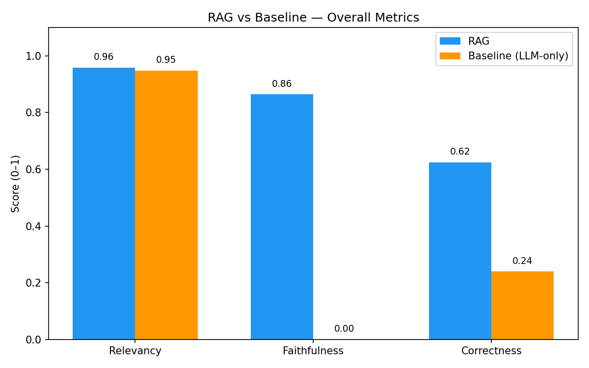
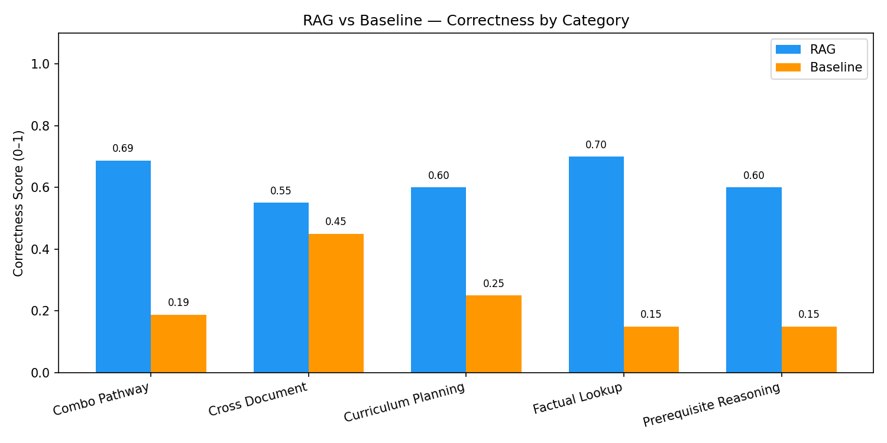
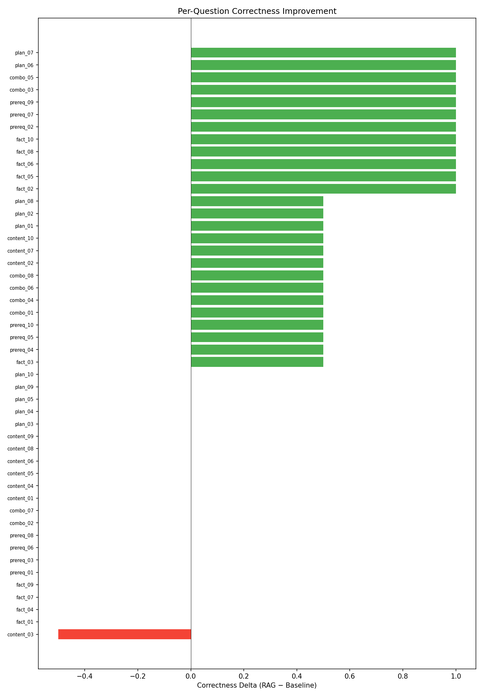

# RAG vs Baseline Benchmark Report

## Overall Metrics

| Metric | RAG | Baseline | Delta |
|--------|-----|----------|-------|
| Relevancy | 0.958 | 0.948 | +0.010 |
| Faithfulness | 0.865 | 0.000 | +0.865 |
| Correctness | 0.625 | 0.240 | +0.385 |

## By Category (Correctness)

| Category | RAG | Baseline | Delta |
|----------|-----|----------|-------|
| Combo Pathway | 0.688 | 0.188 | +0.500 |
| Cross Document | 0.550 | 0.450 | +0.100 |
| Curriculum Planning | 0.600 | 0.250 | +0.350 |
| Factual Lookup | 0.700 | 0.150 | +0.550 |
| Prerequisite Reasoning | 0.600 | 0.150 | +0.450 |

## Detailed Results

| ID | Category | RAG Correct | Base Correct | Tools Used |
|----|----------|-------------|--------------|------------|
| fact_01 | factual_lookup | 0.0 | 0.0 | vector_search, prerequisite_lookup |
| fact_02 | factual_lookup | 1.0 | 0.0 | curriculum_browser |
| fact_03 | factual_lookup | 1.0 | 0.5 | curriculum_browser |
| fact_04 | factual_lookup | 0.0 | 0.0 | vector_search, vector_search |
| fact_05 | factual_lookup | 1.0 | 0.0 | curriculum_browser |
| fact_06 | factual_lookup | 1.0 | 0.0 | curriculum_browser |
| fact_07 | factual_lookup | 1.0 | 1.0 | vector_search |
| fact_08 | factual_lookup | 1.0 | 0.0 | curriculum_browser |
| fact_09 | factual_lookup | 0.0 | 0.0 | vector_search |
| fact_10 | factual_lookup | 1.0 | 0.0 | curriculum_browser |
| prereq_01 | prerequisite_reasoning | 0.5 | 0.5 | prerequisite_lookup |
| prereq_02 | prerequisite_reasoning | 1.0 | 0.0 | prerequisite_lookup |
| prereq_03 | prerequisite_reasoning | 0.0 | 0.0 | prerequisite_lookup |
| prereq_04 | prerequisite_reasoning | 0.5 | 0.0 | prerequisite_lookup |
| prereq_05 | prerequisite_reasoning | 1.0 | 0.5 | prerequisite_lookup |
| prereq_06 | prerequisite_reasoning | 0.0 | 0.0 | prerequisite_lookup |
| prereq_07 | prerequisite_reasoning | 1.0 | 0.0 | prerequisite_lookup |
| prereq_08 | prerequisite_reasoning | 0.5 | 0.5 | prerequisite_lookup |
| prereq_09 | prerequisite_reasoning | 1.0 | 0.0 | prerequisite_lookup |
| prereq_10 | prerequisite_reasoning | 0.5 | 0.0 | prerequisite_lookup |
| combo_01 | combo_pathway | 0.5 | 0.0 | combo_navigator |
| combo_02 | combo_pathway | 0.5 | 0.5 | combo_navigator |
| combo_03 | combo_pathway | 1.0 | 0.0 | combo_navigator |
| combo_04 | combo_pathway | 0.5 | 0.0 | combo_navigator |
| combo_05 | combo_pathway | 1.0 | 0.0 | combo_navigator |
| combo_06 | combo_pathway | 0.5 | 0.0 | combo_navigator |
| combo_07 | combo_pathway | 0.5 | 0.5 | combo_navigator |
| combo_08 | combo_pathway | 1.0 | 0.5 | combo_navigator |
| content_01 | cross_document | 0.5 | 0.5 | vector_search, vector_search |
| content_02 | cross_document | 1.0 | 0.5 | vector_search |
| content_03 | cross_document | 0.0 | 0.5 | vector_search, vector_search |
| content_04 | cross_document | 0.5 | 0.5 | vector_search |
| content_05 | cross_document | 0.5 | 0.5 | vector_search, vector_search |
| content_06 | cross_document | 0.5 | 0.5 | vector_search, vector_search |
| content_07 | cross_document | 1.0 | 0.5 | vector_search |
| content_08 | cross_document | 0.5 | 0.5 | vector_search, vector_search, vector_search |
| content_09 | cross_document | 0.0 | 0.0 | vector_search, vector_search |
| content_10 | cross_document | 1.0 | 0.5 | vector_search |
| plan_01 | curriculum_planning | 1.0 | 0.5 | curriculum_browser |
| plan_02 | curriculum_planning | 0.5 | 0.0 | prerequisite_lookup, prerequisite_lookup |
| plan_03 | curriculum_planning | 1.0 | 1.0 | prerequisite_lookup |
| plan_04 | curriculum_planning | 0.0 | 0.0 | prerequisite_lookup |
| plan_05 | curriculum_planning | 0.5 | 0.5 | prerequisite_lookup, prerequisite_lookup |
| plan_06 | curriculum_planning | 1.0 | 0.0 | curriculum_browser |
| plan_07 | curriculum_planning | 1.0 | 0.0 | vector_search |
| plan_08 | curriculum_planning | 0.5 | 0.0 | vector_search |
| plan_09 | curriculum_planning | 0.0 | 0.0 | vector_search, prerequisite_lookup, prerequisite_lookup |
| plan_10 | curriculum_planning | 0.5 | 0.5 | combo_navigator |
